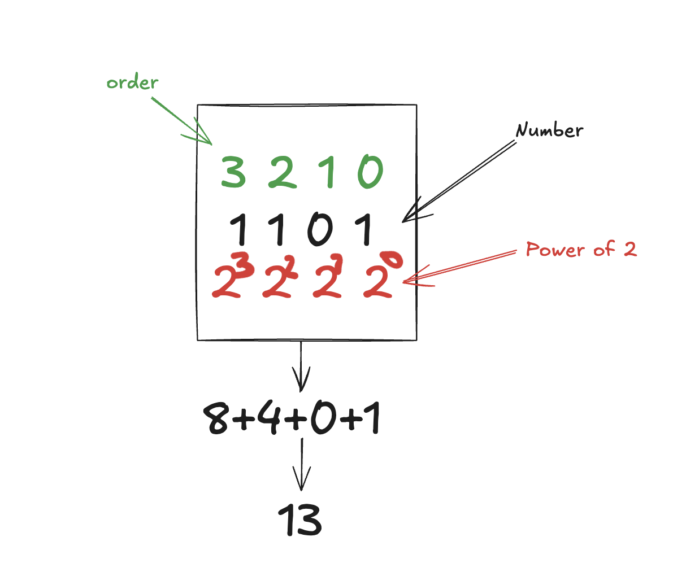

# Ready, Set, Boole!

Boolean Algebra and Bitwise Operations - Personal Learning Notes

## Binary Number System

### Binary ↔ Decimal Conversion



Each bit position = a power of 2. Add them up!

**Key concept**: Binary uses powers of 2 (like decimal uses powers of 10)

## Bitwise Operators

### AND (&) - Both must be 1
```
  0101  (5)
& 0011  (3)
------
  0001  (1)
```
**Use**: Detect where both bits are 1 → finds carries in addition

### OR (|) - At least one is 1
```
  0101  (5)
| 0011  (3)
------
  0111  (7)
```

### XOR (^) - Different bits = 1
```
  0101  (5)
^ 0011  (3)
------
  0110  (6)
```
**Use**: Sum without carry! (Key for adder)

### NOT (~) - Flip all bits
```
~ 0101 → 1010
```

### Shifts (<< >>)
```
0101 << 1 → 1010   (multiply by 2)
1010 >> 1 → 0101   (divide by 2)
```
**Use**: Move carries to next position

## Binary Addition

### Rules
```
0 + 0 = 0
0 + 1 = 1
1 + 0 = 1
1 + 1 = 10  (write 0, carry 1)
```

### Example: 5 + 3 = 8
```
    0101  (5)
  + 0011  (3)
  ------
    1000  (8)
```

### Adder Algorithm (no + operator!)
1. **XOR** → sum without carry
2. **AND** → detect where carries happen
3. **Shift left** → move carries to next position
4. **Repeat** until no more carries

## Important: Type Sizes

```cpp
uint32_t a = 5;  // ALWAYS 32 bits in memory!
// 00000000 00000000 00000000 00000101
// All leading zeros are there!
```

**Why it matters**: Bitwise operators work on ALL 32 bits, not just the "useful" ones.

**Complexity**:
- O(log n) = O(32) = O(1) for fixed-size types
- We process ~32 bits max (the number of bits needed to represent max value)

## Exercises

### ex00 - Adder
Build addition using ONLY bitwise operators (no `+`)
- Complexity: O(log n) time, O(log n) space

### ex01 - Multiplier
Build multiplication using ONLY bitwise operators (no `*`)
- Complexity: O(1) time, O(1) space

### ex02-09
Boolean logic, truth tables, SAT solving, set theory...

---

**Remember**: Work on paper first! Draw diagrams, trace through examples manually.

**Source**: `en.subject.pdf` - Read it carefully!
