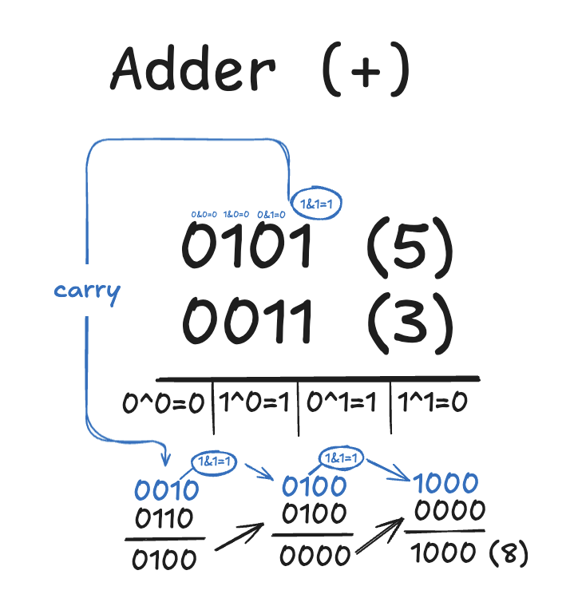
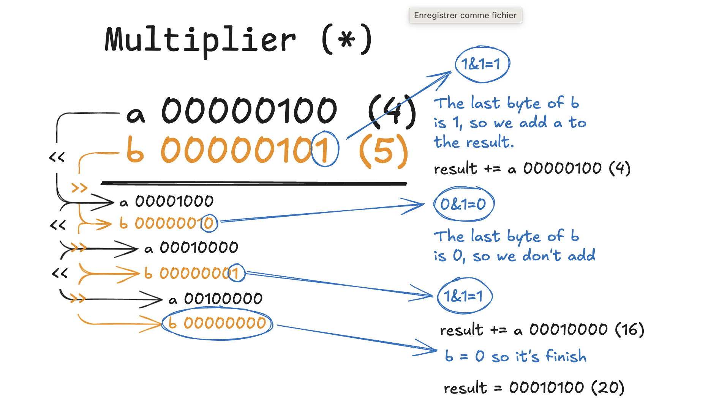
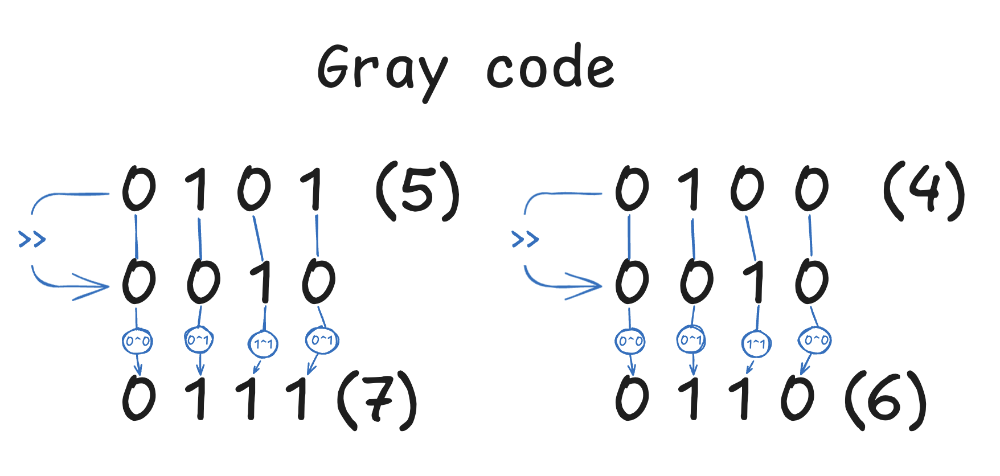
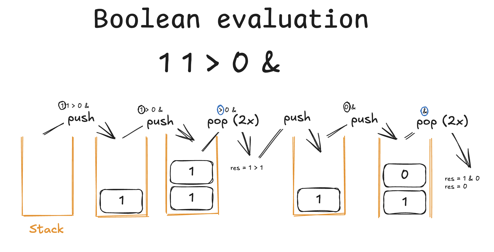

# Ready, Set, Boole!

Boolean Algebra and Bitwise Operations - Personal Learning Notes

## Binary Number System

### Binary ↔ Decimal Conversion


Each bit position = a power of 2

**Key concept**: Binary uses powers of 2 (like decimal uses powers of 10)

## Bitwise & Boolean Operators

### Basic Bitwise Operators

#### AND (&) - Both must be 1
```
0 & 0 = 0
0 & 1 = 0
1 & 0 = 0
1 & 1 = 1
```
**Use**: Detect where both bits are 1, find carries in addition

#### OR (|) - At least one is 1
```
0 | 0 = 0
0 | 1 = 1
1 | 0 = 1
1 | 1 = 1
```
**Use**: Combine bits, set flags

#### XOR (^) - Different bits = 1
```
0 ^ 0 = 0
0 ^ 1 = 1
1 ^ 0 = 1
1 ^ 1 = 0
```
**Use**: Sum without carry, toggle bits, detect differences

#### NOT (~) - Flip all bits
```
~ 0101 → 1010
```
**Use**: Invert all bits, logical negation

#### Shifts (<< >>)
```
0101 << 1 → 1010   (multiply by 2)
1010 >> 1 → 0101   (divide by 2)
```
**Use**: Fast multiplication/division by powers of 2, move carries

### Boolean Logic Operators

Used in propositional logic (ex03+):

#### NOT (!) - Logical Negation
```
!0 = 1
!1 = 0
```
**Meaning**: Flip the truth value - true becomes false, false becomes true

#### IMPLY (>) - Material Implication
```
A > B = !A | B

0 > 0 = 1    "false implies false" = true
0 > 1 = 1    "false implies true" = true
1 > 0 = 0    "true implies false" = false
1 > 1 = 1    "true implies true" = true
```
**Meaning**: "If A then B" - Only false when A is true but B is false

#### EQUIV (=) - Logical Equivalence
```
A = B = !(A ^ B)  or  (A > B) & (B > A)

0 = 0 = 1    "both false" = equivalent
0 = 1 = 0    "different values" = not equivalent
1 = 0 = 0    "different values" = not equivalent
1 = 1 = 1    "both true" = equivalent
```
**Meaning**: "A if and only if B" - True when both have the same value

## Exercises

---

### ex00 - Adder
Build addition using ONLY bitwise operators (no `+`)
- Complexity: O(log n) time, O(log n) space

**Complexity explanation**:
- O(log n) measures how execution time grows with input size
- For our adder: n = max value representable, iterations = number of bits
- uint32_t needs 32 bits → log₂(2³²) = 32 iterations max
- No matter the values (5+3 or 4 billion+1), max 32 iterations
- O(log n) = O(32) = O(1) for fixed-size types


---

### ex01 - Multiplier
Build multiplication using ONLY bitwise operators (no `*`)
- Complexity: O(1) time, O(1) space

**Algorithm**: Shift and add
1. Check if last bit of `b` is 1 → if yes, add `a` to result
2. Shift `a` left (×2) and `b` right (÷2)
3. Repeat until `b` becomes 0



---

### ex02 - Gray Code
Convert binary to Gray code using ONLY bitwise operators
- Complexity: O(1) time, O(1) space

**What is Gray Code?**
Binary encoding where consecutive values differ by only 1 bit.

**Formula**: `gray(n) = n ^ (n >> 1)`

**How it works:**
XOR each bit with the next bit (shift right to compare neighbors)



---

### ex03 - Boolean evaluation
Evaluate propositional formulas in Reverse Polish Notation (RPN)
- Complexity: O(n) time

**What is RPN?**
Postfix notation where operators come after operands: `AB&` means `A AND B`

**Algorithm**: Stack-based evaluation
1. Read formula left to right
2. Numbers (0/1) → push to stack
3. Unary operator (!) → pop 1, apply operation, push result
4. Binary operator (&|^>=) → pop 2, apply operation, push result
5. Final stack value = result

**Example**: `11>0&` evaluates to `0`



**Key operators**:
- `!` (NOT): Negation - flips the value
- `&` (AND): Both must be true
- `|` (OR): At least one must be true
- `^` (XOR): Exactly one must be true (different values)
- `>` (IMPLY): `!A | B` - False only when A=true and B=false
- `=` (EQUIV): `!(A ^ B)` - True when both have same value

---

### ex04-09
Truth tables, NNF, CNF, SAT solving, set theory...
