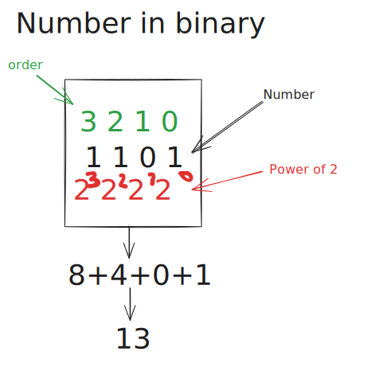
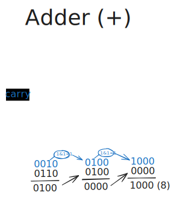
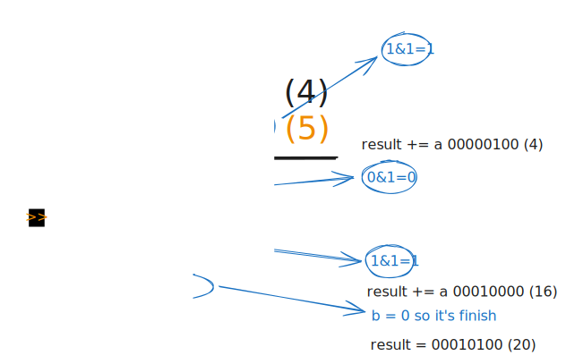
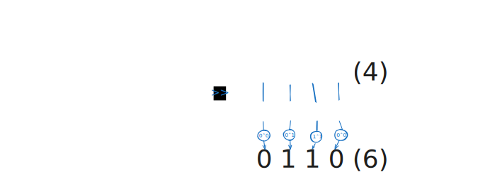
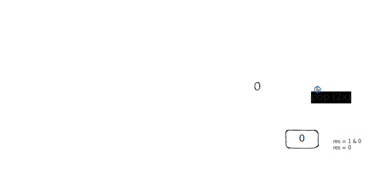
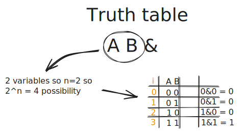

# Ready, Set, Boole!

> Personal learning notes on binary numbers, bitwise operations, and propositional logic.

## Contents

- [Binary Number System](#binary-number-system)
- [Bitwise & Boolean Operators](#bitwise--boolean-operators)
- [ex00 — Adder](#ex00--adder)
- [ex01 — Multiplier](#ex01--multiplier)
- [ex02 — Gray Code](#ex02--gray-code)
- [ex03 — Boolean evaluation](#ex03--boolean-evaluation)
- [ex04 — Truth table](#ex04--truth-table)
- [Build & Run](#build--run)

## Binary Number System

### Core concepts

#### Binary ↔ Decimal Conversion



Each bit position represents a power of 2.

**Key concept**: Binary uses powers of 2 (like decimal uses powers of 10).

## Bitwise & Boolean Operators

### Basic Bitwise Operators

#### AND (`&`) — Both must be 1

```
0 & 0 = 0
0 & 1 = 0
1 & 0 = 0
1 & 1 = 1
```

**Use**: Detect where both bits are 1, find carries in addition.

#### OR (`|`) — At least one is 1

```
0 | 0 = 0
0 | 1 = 1
1 | 0 = 1
1 | 1 = 1
```

**Use**: Combine bits, set flags.

#### XOR (`^`) — Different bits = 1

```
0 ^ 0 = 0
0 ^ 1 = 1
1 ^ 0 = 1
1 ^ 1 = 0
```

**Use**: Sum without carry, toggle bits, detect differences.

#### NOT (`~`) — Flip all bits

```
~0101 → 1010
```

**Use**: Invert all bits, logical negation.

#### Shifts (`<<`, `>>`)

```
0101 << 1 → 1010  (multiply by 2)
1010 >> 1 → 0101  (divide by 2)
```

**Use**: Fast multiplication/division by powers of 2, move carries.

### Boolean Logic Operators

Used in propositional logic (ex03+).

#### NOT (`!`) — Logical negation

```
!0 = 1
!1 = 0
```

**Meaning**: Flip the truth value — true becomes false, false becomes true.

#### IMPLY (`>`) — Material implication

```
A > B = !A | B

0 > 0 = 1  (false implies false)
0 > 1 = 1  (false implies true)
1 > 0 = 0  (true implies false)
1 > 1 = 1  (true implies true)
```

**Meaning**: "If A then B" — false only when A is true and B is false.

#### EQUIV (`=`) — Logical equivalence

```
A = B = !(A ^ B)  or  (A > B) & (B > A)

0 = 0 = 1  (both false)
0 = 1 = 0  (different values)
1 = 0 = 0  (different values)
1 = 1 = 1  (both true)
```

**Meaning**: "A if and only if B" — true when both values are the same.

## ex00 — Adder

Build addition using **only bitwise operators** (no `+`).

- **Complexity**: O(log n) time, O(log n) space. — One iteration per bit (32 max for `uint32_t`).



## ex01 — Multiplier

Build multiplication using **only bitwise operators** (no `*`).

- **Complexity**: O(1) time, O(1) space. — Fixed 32 iterations (one per bit of `b`).

**Algorithm**: Shift and add.

1. If the last bit of `b` is 1, add `a` to the result.
2. Shift `a` left (×2) and `b` right (÷2).
3. Repeat until `b` becomes 0.



## ex02 — Gray Code

Convert binary to Gray code using **only bitwise operators**.

- **Complexity**: O(1) time, O(1) space. — Single XOR operation.

**What is Gray Code?**

A binary encoding where consecutive values differ by only one bit.

**Formula**:

```
gray(n) = n ^ (n >> 1)
```

**How it works**:

Each bit is XORed with its right neighbor.



## ex03 — Boolean evaluation

Evaluate propositional formulas written in **Reverse Polish Notation (RPN)**.

- **Complexity**: O(n) time. — One pass through the formula of length `n`.

**What is RPN?**

Postfix notation where operators come after operands.

Example:

```
AB&  → A AND B
```

**Algorithm**: Stack-based evaluation.

1. Read the formula from left to right.
2. Numbers (`0` / `1`) → push onto the stack.
3. Unary operator (`!`) → pop 1 value, apply operator, push result.
4. Binary operator (`& | ^ > =`) → pop 2 values, apply operator, push result.
5. The final stack value is the result.

**Example**:

```
11>0& → 0
```

**Key operators**:

- `!` — NOT: negation.
- `&` — AND: both must be true.
- `|` — OR: at least one must be true.
- `^` — XOR: values must differ.
- `>` — IMPLY: `!A | B`.
- `=` — EQUIV: `!(A ^ B)`.



## ex04 — Truth table

Print a truth table for a propositional formula written in **RPN**.

- **Complexity**: O(2^n) time. — One evaluation per combination of `n` variables.

**What is a truth table?**

A table listing the result of a formula for every possible combination of variable values.

With `n` variables, there are `2^n` combinations to test.

**Algorithm**:

1. Extract unique variables from the formula (stored in a sorted `map<char, int>`).
2. Iterate `i` from `0` to `2^n - 1` — each value of `i` encodes one combination.
3. For each variable at index `k`, extract its value from `i` using: `(i >> (n-1-k)) & 1`
4. Evaluate the formula with those variable values.
5. Print the row.

**Bit extraction trick**:

```
i = 2  →  binary: 1  0
                  ↑  ↑
                k=0  k=1
                A=1  B=0

(i >> (n-1-k)) & 1
```

Reading bits left to right maps to variables A, B, C... in alphabetical order.

**Example**:

```
print_truth_table("AB&")

| A | B | = |
|---|---|---|
| 0 | 0 | 0 |
| 0 | 1 | 0 |
| 1 | 0 | 0 |
| 1 | 1 | 1 |
```


